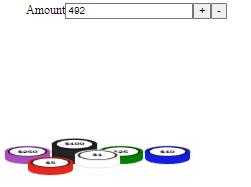

# PokerMoons Chip Display in W.A.S.M. via RUST

The poker moons chip display takes in a dollar amount, and calculates the individual stacks of poker chips to visualize that amount given the poker chip denominations.

> 

For curiosity sake I've compared the performance of rendering our poker chips in `Angular` vs W.A.S.M `Rust`.

## Results:

These values were tested on the default `Production` builds of each approach. For a small stack size, it's
basically impossible to tell the difference visually. But with the 5 stacks test, it is extremely noticeable.
Each environment is essentially running equivelent code, but one is in `Rust` for WASM, and the other is in `Typescript` for angular.

### Render of `1 x $4,999,999` chip stack

> 

`Angular`

- ~25ms per render

`WASM/Rust`

- ~1ms per render

### Render of `5 x $4,999,999` chip stacks

> 

`Angular`

- ~130ms per render

  > 

`WASM/Rust`

- ~2.5ms per render

  > 
