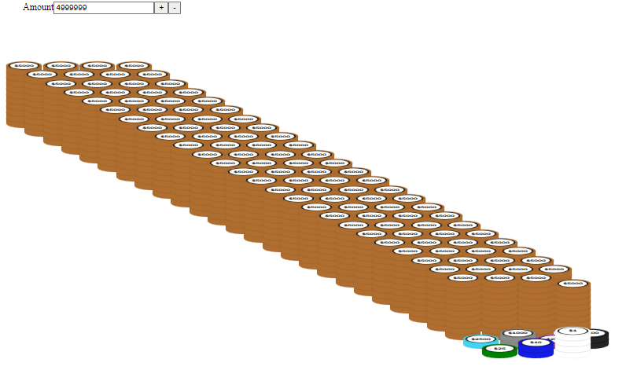
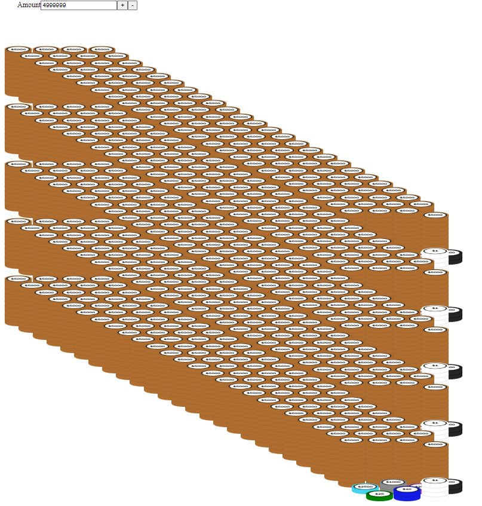
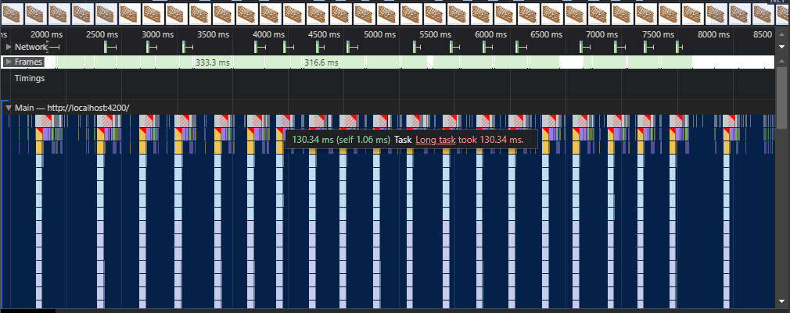
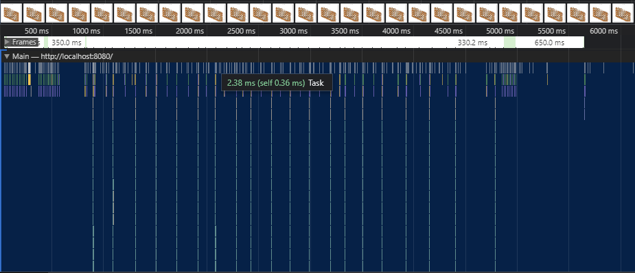

# PokerMoons Poker Chip Display in W.A.S.M. via RUST

For curiosity sake I've compared the performance of rendering our poker chips in `Angular` vs W.A.S.M `Rust`.

## Results:

These values were tested on the default `Production` builds of each approach. For a small stack size, it's
basically impossible to tell the difference visually. But with the 5 stacks test, it is extremely noticeable.

### Rerender of `1 x $4,999,999` chip stack

`Angular`

- ~25ms per rerender

`Rust`

- ~1ms per rerender

### Rerender of `5 x $4,999,999` chip stacks

`Angular`

- ~130ms per rerender

  

`Rust`

- ~2.5ms per rerender

  
